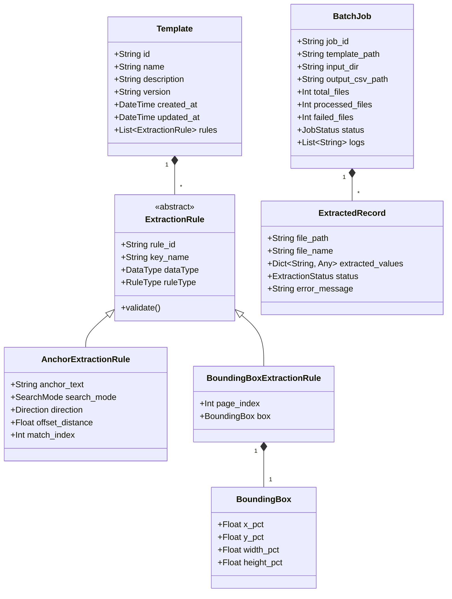

# Data Model: PDF Data Extractor

**Feature**: PDF Data Extractor  
**Date**: 2026-09-18  

## Overview
This document defines the core domain entities, data types, validation constraints, and relationships for the PDF Data Extractor application.

---

## Domain Entities

---

## Entity Details

### 1. Template
Represents a saved configuration for extracting data from a specific document form.

| Field | Type | Required | Default | Validation / Constraints |
|---|---|---|---|---|
| `id` | String (UUID) | Yes | Auto-generated | Valid UUID v4 string |
| `name` | String | Yes | N/A | Non-empty, max 100 chars |
| `description` | String | No | `""` | Max 500 chars |
| `version` | String | Yes | `"1.0.0"` | SemVer format |
| `created_at` | DateTime | Yes | Current ISO-8601 | Standard ISO timestamp |
| `updated_at` | DateTime | Yes | Current ISO-8601 | Standard ISO timestamp |
| `rules` | List[ExtractionRule] | Yes | `[]` | Must contain unique `key_name` identifiers |

---

### 2. ExtractionRule (Abstract Base)
Defines how a specific key value is identified and parsed.

| Field | Type | Required | Description |
|---|---|---|---|
| `rule_id` | String (UUID) | Yes | Unique rule identifier |
| `key_name` | String | Yes | Column name in CSV output (must be unique per template, alphanumeric + underscores) |
| `data_type` | `DataType` Enum | Yes | `STRING`, `NUMBER`, `CURRENCY`, `DATE` |
| `rule_type` | `RuleType` Enum | Yes | `ANCHOR_SEARCH`, `BOUNDING_BOX` |

#### Subclass: AnchorExtractionRule
- `anchor_text` (String): Search target string (e.g. "Tổng giá trị hoá đơn").
- `search_mode` (Enum): `EXACT`, `CONTAINS`, `REGEX`, `CASE_INSENSITIVE`.
- `direction` (Enum): `RIGHT`, `BELOW`, `LEFT`, `ABOVE`.
- `offset_distance` (Float): Max distance in points/pixels to look for nearby value (Default: `150.0`).
- `match_index` (Int): Which occurrence to target if multiple exist on page (`0` = first match).

#### Subclass: BoundingBoxExtractionRule
- `page_index` (Int): 0-indexed PDF page number (Default: `0`).
- `box` (`BoundingBox`): Normalized box coordinates.

---

### 3. BoundingBox
Normalized coordinate box relative to PDF page dimensions (0.0 to 1.0 / 0% to 100%).

| Field | Type | Range | Description |
|---|---|---|---|
| `x_pct` | Float | `0.0` - `1.0` | Top-left X coordinate percentage |
| `y_pct` | Float | `0.0` - `1.0` | Top-left Y coordinate percentage |
| `width_pct` | Float | `0.0` - `1.0` | Box width percentage |
| `height_pct` | Float | `0.0` - `1.0` | Box height percentage |

---

### 4. BatchJob & ExtractedRecord
State models for parallel execution engine.

- **`BatchJob`**:
  - `status`: `PENDING`, `RUNNING`, `COMPLETED`, `CANCELLED`, `FAILED`.
  - `total_files`: Count of `.pdf` files discovered.
- **`ExtractedRecord`**:
  - Maps `key_name` -> Extracted string/formatted value.
  - `status`: `SUCCESS`, `PARTIAL_SUCCESS`, `FAILED`.
