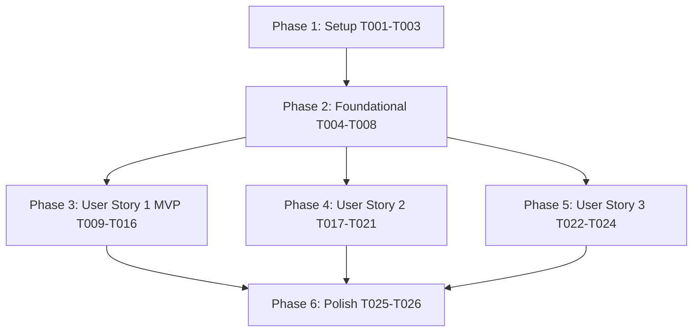

# Tasks: PDF Data Extractor

**Feature**: PDF Data Extractor  
**Branch**: `001-pdf-data-extractor`  
**Date**: 2026-09-18  
**Spec**: [`spec.md`](file:///d:/Coding/LearnSpecKit/Proj1/specs/001-pdf-data-extractor/spec.md) | **Plan**: [`plan.md`](file:///d:/Coding/LearnSpecKit/Proj1/specs/001-pdf-data-extractor/plan.md)

---

## Phase 1: Setup (Shared Infrastructure)

**Purpose**: Project initialization and directory structure

- [x] T001 Create project source directory structure (`src/domain/`, `src/strategies/`, `src/services/`, `src/ui/`, `src/controllers/`, `tests/unit/`, `tests/integration/`) in `src/`
- [x] T002 Initialize Python environment configuration and dependencies (`PySide6`, `PyMuPDF`, `pydantic`, `pytest`, `pytest-qt`) in `requirements.txt`
- [x] T003 [P] Configure code style, linting, and pytest settings in `pyproject.toml`

---

## Phase 2: Foundational (Blocking Prerequisites)

**Purpose**: Core domain models, enums, strategy interfaces, and service infrastructure

- [x] T004 [P] Create core domain enums (`DataType` [`STRING`, `NUMBER`, `CURRENCY`, `DATE`], `SearchMode` [`EXACT`, `CONTAINS`, `REGEX`, `CASE_INSENSITIVE`], `Direction` [`RIGHT`, `BELOW`, `LEFT`, `ABOVE`], `RuleType` [`ANCHOR_SEARCH`, `BOUNDING_BOX`], `JobStatus`) in `src/domain/enums.py`
- [x] T005 [P] Create Pydantic domain models in `src/domain/models.py`:
  - `BoundingBox` (`x_pct`, `y_pct`, `width_pct`, `height_pct` floats between `0.0` and `1.0`)
  - `ExtractionRule` base schema (`rule_id` UUID v4, `key_name` regex `^[a-zA-Z0-9_]+$`, `data_type`, `rule_type`)
  - `AnchorExtractionRule` (`anchor_text`, `search_mode`, `direction`, `offset_distance` min 0, default 150.0, `match_index` min 0)
  - `BoundingBoxExtractionRule` (`page_index` min 0, `box` `BoundingBox`)
  - `Template` (`id` UUID v4, `name` max 100 chars, `description` max 500 chars, `version` SemVer pattern `^\d+\.\d+\.\d+$`, `created_at`, `updated_at`, `rules` list of unique key names)
  - `BatchJob` and `ExtractedRecord`
- [x] T006 [P] Implement abstract strategy interface `IExtractionStrategy` with method `extract(doc: fitz.Document, page_num: int) -> Optional[str]` in `src/strategies/base.py`
- [x] T007 [P] Implement PyMuPDF document loader and spatial text block extraction helper service in `src/services/pdf_service.py`
- [x] T008 Implement template repository for JSON serialization/deserialization and `.pdftpl` schema validation in `src/services/template_repository.py`

**Checkpoint**: Foundation ready - user story implementation can begin in parallel.

---

## Phase 3: User Story 1 - Template Creation & Value Extraction Rules (Priority: P1) ⭐ MVP

**Goal**: Enable users to open a sample PDF document, define Anchor Search & Bounding Box extraction rules, preview detected values, and save template files (`.pdftpl`).

**Independent Test**: Open a sample PDF in the UI, define an Anchor rule (search "Tổng giá trị hoá đơn", type `CURRENCY`, key `total_amount`) and a Bounding Box rule (key `vendor_address`), verify highlighted extraction preview on canvas, and click "Save Template" to output a valid `.pdftpl` JSON file.

### Implementation for User Story 1

- [x] T009 [P] [US1] Implement `AnchorExtractionStrategy` (searches for anchor text on target PDF page and locates nearby character block in specified direction offset) in `src/strategies/anchor_strategy.py`
- [x] T010 [P] [US1] Implement `BoundingBoxExtractionStrategy` (converts normalized percentage coordinates to page point bounds and extracts intersecting text) in `src/strategies/bounding_box_strategy.py`
- [x] T011 [US1] Implement `ExtractionStrategyFactory` in `src/strategies/factory.py` (instantiates strategies from rule models, depends on T009, T010)
- [x] T012 [P] [US1] Create interactive PDF canvas widget `PdfCanvasWidget` using PySide6 `QGraphicsView` supporting page rendering, zoom/pan, and rubber-band bounding box drag selection in `src/ui/pdf_canvas.py`
- [x] T013 [P] [US1] Create rule creation dialog `RuleDialog` supporting both Anchor Search and Bounding Box input parameter forms in `src/ui/rule_dialog.py`
- [x] T014 [US1] Create single template workspace widget `WorkspaceTabWidget` integrating PDF canvas, rule table widget, preview actions, and rule editing controls in `src/ui/workspace_tab.py`
- [x] T015 [US1] Implement `TemplateController` in `src/controllers/template_controller.py` handling canvas event signals, rule additions, live extraction preview, and template file save/load
- [x] T016 [P] [US1] Write unit tests for `AnchorExtractionStrategy` and `BoundingBoxExtractionStrategy` using sample synthetic text blocks in `tests/unit/test_strategies.py`

**Checkpoint**: User Story 1 (MVP) complete and testable independently.

---

## Phase 4: User Story 2 - Parallel Batch Processing & CSV Export (Priority: P2)

**Goal**: Allow users to select a template and target input directory, automatically filter `.pdf` files, process documents concurrently using multi-core process pools, and export structured results to a CSV file.

**Independent Test**: Select a saved template and an input folder containing mixed files (50 PDFs + 10 non-PDFs), run batch processing, verify non-PDFs are filtered out safely, and verify that the generated CSV file contains a header row matching key names and 50 data rows.

### Implementation for User Story 2

- [x] T017 [P] [US2] Implement CSV export builder `CSVExporter` enforcing UTF-8 encoding, header order matching template rules, double-quote escaping, and metadata columns (`_file_name`, `_file_path`, `_status`) in `src/services/csv_exporter.py`
- [x] T018 [US2] Implement parallel batch processing engine `BatchEngine` using `concurrent.futures.ProcessPoolExecutor` with directory filtering (`.pdf` extension filter) and GIL-bypassing worker tasks in `src/services/batch_engine.py`
- [x] T019 [P] [US2] Create batch execution configuration and live progress dialog `BatchDialog` displaying total files, completed count, error count, and log text in `src/ui/batch_dialog.py`
- [x] T020 [US2] Implement `BatchController` in `src/controllers/batch_controller.py` bridging Qt signals with background `BatchEngine` worker events
- [x] T021 [P] [US2] Write integration tests for multi-core `BatchEngine` execution and CSV export formatting in `tests/integration/test_batch_engine.py`

**Checkpoint**: User Story 2 complete and testable independently.

---

## Phase 5: User Story 3 - Multi-Tab Template Management & Workspace (Priority: P3)

**Goal**: Provide a multi-tab user interface allowing users to open, view, edit, and switch between multiple template workspaces simultaneously.

**Independent Test**: Open 3 different template files in the application, observe 3 distinct workspace tabs, edit rules in Tab 1, switch to Tab 2 to preview extractions, and verify each tab maintains isolated state and unsaved changes indicators.

### Implementation for User Story 3

- [x] T022 [P] [US3] Implement dynamic resolution-responsive main window `MainWindow` using PySide6 `QMainWindow` with root `QTabWidget`, initial resolution computation from `QScreen.availableGeometry()`, and dynamic panel splitters in `src/ui/main_window.py`
- [x] T023 [US3] Implement multi-tab lifecycle management (new tab, open file to tab, tab close verification with unsaved prompts) in `src/controllers/template_controller.py`
- [x] T024 [US3] Create application entry point `main.py` initializing PySide6 `QApplication`, High-DPI scaling attributes, and launching `MainWindow` in `src/main.py`

**Checkpoint**: All user stories functional and integrated.

---

## Phase 6: Polish & Cross-Cutting Concerns

- [x] T025 [P] Create user guide and environment setup instructions in `README.md`
- [x] T026 Execute manual quickstart validation scenarios defined in [`quickstart.md`](file:///d:/Coding/LearnSpecKit/Proj1/specs/001-pdf-data-extractor/quickstart.md)

---

## Dependencies & Execution Order

---

## Parallel Execution Opportunities

- **Foundational Phase**: `T004` (enums), `T005` (models), `T006` (strategy base), `T007` (pdf service) can be written in parallel.
- **User Story 1 (MVP)**: `T009` (anchor strategy), `T010` (bounding box strategy), `T012` (canvas widget), `T013` (rule dialog) can be developed in parallel before assembling `T014` (workspace tab) and `T015` (controller).
- **User Story 2**: `T017` (csv exporter) and `T019` (batch dialog) can be developed in parallel before `T018` (batch engine) integration.
- **User Story 3**: `T022` (main window) can be developed alongside controllers.

---

## Implementation Strategy & MVP Scope

1. Complete **Phase 1: Setup** and **Phase 2: Foundational** (blocking prerequisite).
2. Complete **Phase 3: User Story 1 (MVP)** — allows creating, testing, and saving template rules on sample PDFs.
3. Validate User Story 1 independently.
4. Add **Phase 4: User Story 2** for bulk parallel processing & CSV output.
5. Add **Phase 5: User Story 3** for multi-tab document management.
6. Run Phase 6 validation scenarios.
